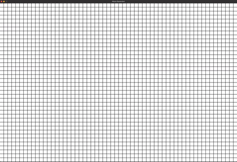

# maze-generator
Maze generator with visualisation written using SDL2 library.

Program to generate and visualize mazes using various algorithms.
In addition, algorithm for shortest path between two cells is implemented, also with visualisation.

Controls:
  - '1' Recursive backtracker algorithm.
  - '2' Hunt and kill algorithm.
  - '3' Wilson's algorithm
  - '4' Kruskal's algorithm (terribly slow)
  - '5' Prim's simplified algorithm.
  - LEFT MOUSE CLICK to set start cell
  - MOUSE MOUSE CLICK to set end cell
  - UP ARROW to increase cell size
  - DOWN ARROW to decrease cell size
  - Hold Left SHIFT + Left MOUSE BUTTON to carve custom mazes (creation of cycles is prevented)
  - 'a' to generate longest possible path in maze. (Maze must be 'perfect' - there exists exactly 1 path between any pair of cells)
  - 'r' to reset board.
  - 't' or 'y' to generate 5000 of mazes with each of the 5 algorithms and check for each if it contains a cycle - if the maze is 'perfect'. 't' option is implemented using extremely simple multithreading, 'y' option is single thread. Multi threaded option is about 25% faster. Times reported in output.

Compiled with provided Makefile.

Great source for maze generation algorithms is [Mazes for Programmers: Code Your Own Twisty Little Passages by Jamis Buck.](http://www.mazesforprogrammers.com)

